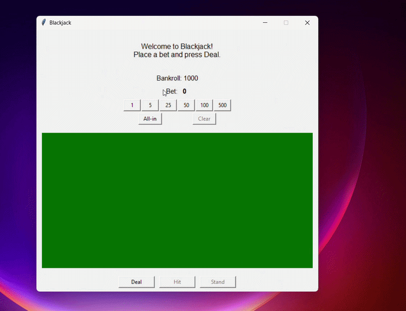

# Blackjack

## Features
- Classic Blackjack rules (Hit / Stand, dealer draws to 17)
- Automatic Ace handling (1 or 11)
- Betting with chips (configurable chip values)
- Interactive UI

## Demo


## Project Structure
```bash
.
├── main.py 
├── core/
│ ├── game.py # BlackjackGame engine
│ ├── hand.py # Hand logic (value, bust, blackjack)
│ ├── shoe.py # Shoe / Deck logic
│ └── player_dealer.py 
│ 
├── ui/
│ └── ui.py
│  
└── tests/
└── test_blackjack.py # pytest tests
```

## Quick Start
```bash
python -m venv .venv
.venv\Scripts\activate

python main.py
```
